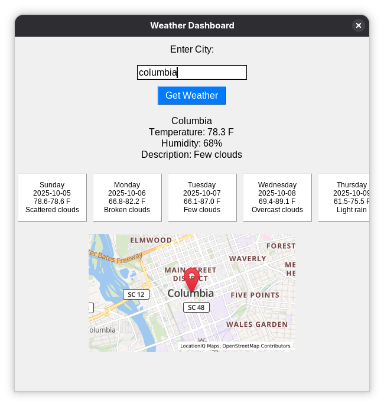

WeatherApp
WeatherApp is a desktop application that provides current weather information and a 5-day forecast for any city, displayed in a clean, text-based interface with a map. Built with Python, Tkinter, Flask, and external APIs, it offers a simple yet functional way to check weather conditions.
Features

  
  
Current Weather Display: Shows the current temperature (in Fahrenheit), humidity, and weather description for a user-specified city.  
5-Day Forecast: Displays a horizontal layout of the next five days’ weather, including:  
Day of the week (e.g., Monday)  
Date (YYYY-MM-DD)  
Temperature range (min–max in Fahrenheit, e.g., 58.2–62.3 F)  
Weather description (e.g., Partly cloudy)  

Requirements

Operating System:Linux   
Python: Version 3.6 or higher  
Dependencies:  
Python packages: flask, requests, python-dotenv, Pillow (for Tkinter image handling)  
System package: python3-tkinter (Tkinter for GUI)  

API Keys:  
OpenWeatherMap API Key for weather and forecast data  
LocationIQ API Key for static maps  

Setup Instructions  
1. Clone the Repository  
git clone https://github.com/lintony6/WeatherApp.git  
cd WeatherApp  

2. Set Up a Virtual Environment  
Create and activate a Python virtual environment:  
python3 -m venv venv  
source venv/bin/activate  

3. Install Dependencies  
Install required Python packages:  
pip install -r requirements.txt  

Install Tkinter (if not already included with Python):  
sudo dnf install python3-tkinter  

4. Configure API Keys
Create a .env file in the WeatherApp directory with your API keys:  
echo -e "OpenWeatherMapAPIKey=your_openweather_key_here  
  LocationIQKey=pk.your_locationiq_key_here" > .env  

Get an OpenWeatherMap API key from https://home.openweathermap.org/api_keys (wait ~10 minutes for activation).  
Get a LocationIQ API key from https://locationiq.com.  

5. Verify Project Structure  
Ensure the following files are in working dir:  

frontend.py: Tkinter frontend for the GUI  
backend.py: Flask backend for API requests  
requirements.txt: Python package dependencies
.env: API keys  
.gitignore: Ignores .env, __pycache__, and *.pyc  

6. Run the Backend  
Start the Flask backend:  
cd ~/dev/WeatherApp  
source venv/bin/activate  
python backend.py  

Confirm output: Running on http://127.0.0.1:5000.  

7. Run the Frontend  
In a new terminal:  
cd ~/dev/WeatherApp  
source venv/bin/activate  
python frontend.py  

8. Use the App  

Enter a city name (e.g., "London,UK") in the text field.  
Press Enter or click "Get Weather".  
View:  
Current weather (e.g., "Temperature: 59.0 F, Humidity: 80%, Description: Partly cloudy")  
5-day forecast (e.g., "Monday  
2025-10-06 58.2-62.3 F
  Partly cloudy"  
  in horizontal cards)  
LocationIQ map centered on the city  

Project Structure  
WeatherApp/  
├── frontend.py       # Tkinter GUI for user input and display  
├── backend.py        # Flask API for weather and forecast data  
├── requirements.txt  # Python package dependencies  
├── .env             # API keys (not tracked by git)  
├── .gitignore       # Ignores .env, __pycache__, *.pyc  
